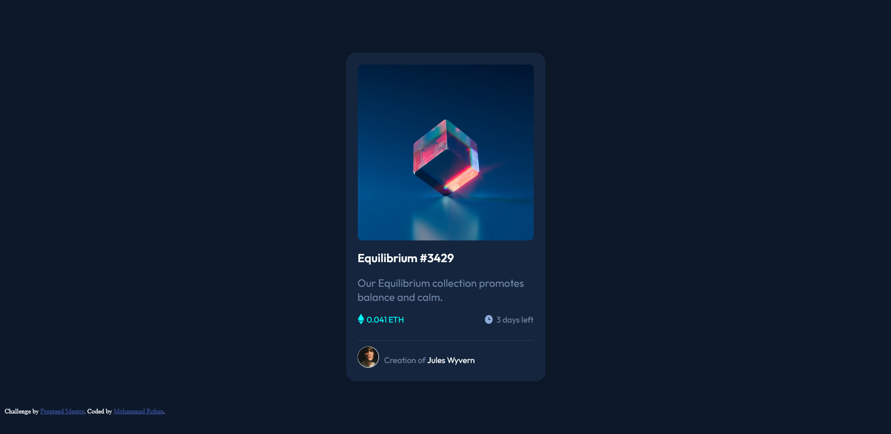
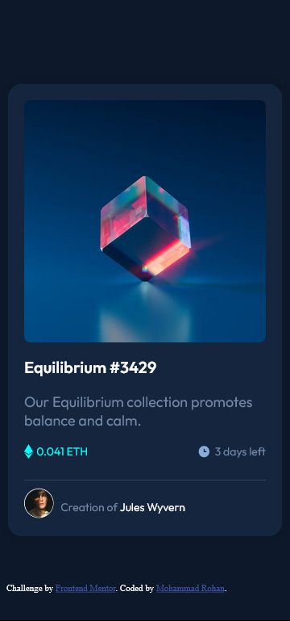

# Frontend Mentor - NFT preview card component solution

This is a solution to the [NFT preview card component challenge on Frontend Mentor](https://www.frontendmentor.io/challenges/nft-preview-card-component-SbdUL_w0U). Frontend Mentor challenges help you improve your coding skills by building realistic projects.

## Table of contents

-   [Overview](#overview)

    -   [The challenge](#the-challenge)
    -   [Screenshot](#screenshot)

-   [My process](#my-process)
    -   [Built with](#built-with)
-   [Useful resources]

### The challenge

Users should be able to:

-   View the optimal layout depending on their device's screen size
-   See hover states for interactive elements

### Screenshot

### Built with

-   Semantic HTML5 markup
-   CSS
-   Google fonts
-   Mobile-first workflow

### Useful resources

-   [Example resource 1](https://developer.mozilla.org/en-US/docs/Web/CSS) - Reference for CSS, very comprehensive and concise.
